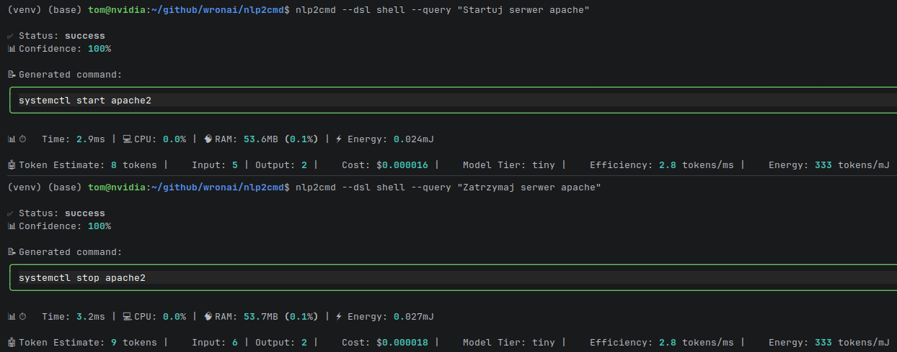
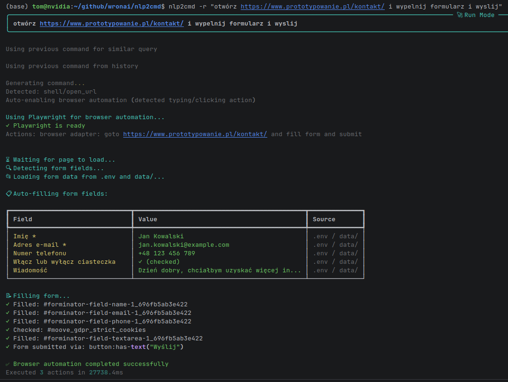

wypełnianie formularza   


# NLP2CMD

[](https://www.python.org/downloads/)
[](https://opensource.org/licenses/MIT)
[](https://github.com/psf/black)

**Natural Language to Domain-Specific Commands** - Production-ready framework for transforming natural language into DSL commands with full safety, validation, and observability.

## 🏗️ Architecture v0.2.0: LLM as Planner + Typed Actions

```
   ┌─────────────────┐
   │   User Query    │
   └────────┬────────┘
            │
            ▼
   ┌─────────────────┐
   │   NLP Layer     │ → Intent + Entities
   └────────┬────────┘
            │
            ▼
   ┌─────────────────┐
   │ Decision Router │ → Direct OR LLM Planner?
   └────────┬────────┘
            │
   ┌────────┴────────┐
   │                 │
   ▼                 ▼
┌──────────┐   ┌─────────────┐
│  Direct  │   │ LLM Planner │ → JSON Plan
└────┬─────┘   └──────┬──────┘
     │                │
     └───────┬────────┘
             │
             ▼
┌─────────────────┐
│ Plan Validator  │ → Check against Action Registry
└────────┬────────┘
         │
         ▼
┌─────────────────┐
│  Plan Executor  │ → Execute Typed Actions
└────────┬────────┘
         │
         ▼
┌─────────────────┐
│Result Aggregator│ → Format Output
└────────┬────────┘
         │
         ▼
┌─────────────────┐
│   User Output   │
└─────────────────┘
```

**Key Principle: LLM plans. Code executes. System controls.**

## ✨ Features

### Core Capabilities
- 🗣️ **5 DSL Adapters**: SQL, Shell, Docker, Kubernetes, DQL (Doctrine)
- 📁 **11 File Format Schemas**: Dockerfile, docker-compose, K8s manifests, GitHub workflows, .env, and more
- 🛡️ **Safety Policies**: Allowlist-based action control, no eval/shell execution
- 🔄 **Multi-step Plans**: Support for `foreach` loops and variable references between steps

### New Architecture Components (v0.2.0)
- 🔀 **Decision Router**: Intelligently routes queries to direct execution or LLM planner
- 📋 **Action Registry**: Central registry of 19+ typed actions with full validation
- ⚡ **Plan Executor**: Executes multi-step plans with tracing, retry, and error handling
- 🤖 **LLM Planner**: Generates JSON plans constrained to allowed actions
- 📊 **Result Aggregator**: Multiple output formats (text, table, JSON, markdown)

### Security Features
- ✅ No direct LLM access to system
- ✅ Typed actions (no eval/shell)
- ✅ Allowlist of permitted actions
- ✅ Full plan validation before execution
- ✅ Traceable execution (trace_id per request)

## 📚 Documentation

| Document | Description |
|----------|-------------|
| **[Installation Guide](INSTALLATION.md)** | Setup instructions and installation options |
| **[User Guide](docs/guides/user-guide.md)** | Complete usage tutorial and examples |
| **[CLI Reference](docs/cli-reference.md)** | Comprehensive CLI documentation |
| **[Python API Guide](docs/python-api.md)** | Detailed Python API usage |
| **[Examples Guide](docs/examples-guide.md)** | Comprehensive examples overview |
| **[API Reference](docs/api/README.md)** | Detailed API documentation |
| **[Thermodynamic Integration](THERMODYNAMIC_INTEGRATION.md)** | Advanced optimization with Langevin dynamics |
| **[Thermodynamic Architecture](THERMODYNAMIC_ARCHITECTURE.md)** | Deep technical architecture overview |
| **[Contributing Guide](CONTRIBUTING.md)** | Development guidelines and contribution process |
| **[Generation Module](README_GENERATION.md)** | DSL generation implementation details |
| **[Quick Fix Reference](QUICK_FIX_REFERENCE.md)** | Common issues and solutions |

## 🚀 Quick Start

### Installation

```bash
pip install nlp2cmd
```

Or from source:

```bash
git clone https://github.com/wronai/nlp2cmd.git
cd nlp2cmd
pip install -e ".[dev]"
```

### CLI Usage

The fastest way to use NLP2CMD is through the command line interface:

```bash
# Basic query
nlp2cmd --query "Pokaż użytkowników"

# Specific DSL
nlp2cmd --dsl sql --query "SELECT * FROM users WHERE city = 'Warsaw'"
nlp2cmd --dsl shell --query "Znajdź pliki .log większe niż 10MB"
nlp2cmd --dsl docker --query "Pokaż wszystkie kontenery"
nlp2cmd --dsl kubernetes --query "Skaluj deployment nginx do 3 replik"

# With options
nlp2cmd --explain --query "Sprawdź status systemu"
nlp2cmd --auto-repair --query "Napraw konfigurację nginx"

# Interactive mode
nlp2cmd --interactive

# Environment analysis
nlp2cmd analyze-env
nlp2cmd analyze-env --output environment.json

# File validation and repair
nlp2cmd validate config.json
nlp2cmd repair docker-compose.yml --backup
```

#### Working Examples

```bash
$ nlp2cmd --query "Pokaż użytkowników"
SELECT * FROM unknown_table;

📊 ⏱️  Time: 13.7ms | 💻 CPU: 0.0% | 🧠 RAM: 54.8MB (0.1%) | ⚡ Energy: 0.120mJ

$ nlp2cmd --dsl docker --query "Pokaż wszystkie kontenery"
docker ps -a

📊 ⏱️  Time: 2.2ms | 💻 CPU: 0.0% | 🧠 RAM: 55.2MB (0.1%) | ⚡ Energy: 0.019mJ

$ nlp2cmd --dsl shell --query "Znajdź pliki .log większe niż 10MB"
find . -type f -name "*.log" -size +10MB -exec ls -lh {} \;

📊 ⏱️  Time: 3.1ms | 💻 CPU: 0.0% | 🧠 RAM: 55.1MB (0.1%) | ⚡ Energy: 0.028mJ

$ nlp2cmd analyze-env
╭────── Environment Report ──────╮
│ System: Linux 6.17.0-8-generic │
╰────────────────────────────────╯
                Tools                
┏━━━━━━━━━━━━━━━━┳━━━━━━━━━┳━━━━━━━━┓
┃ Tool           ┃ Version ┃ Status ┃
┡━━━━━━━━━━━━━━━━╇━━━━━━━━━╇━━━━━━━━┩
│ docker         │ 29.1.5  │ ✅     │
│ kubectl        │ -       │ ✅     │
│ git            │ 2.51.0  │ ✅     │
└────────────────┴─────────┴────────┘
```

### Python API Usage

#### Basic Usage (New Architecture)

```python
from nlp2cmd import (
    DecisionRouter,
    RoutingDecision,
    PlanExecutor,
    ExecutionPlan,
    PlanStep,
    ResultAggregator,
    OutputFormat,
    get_registry,
)

# Initialize components
router = DecisionRouter()
executor = PlanExecutor()
aggregator = ResultAggregator()

# Route a query
routing = router.route(
    intent="select",
    entities={"table": "users"},
    text="show all users",
    confidence=0.9,
)

if routing.decision == RoutingDecision.DIRECT:
    # Simple query - direct execution
    plan = ExecutionPlan(steps=[
        PlanStep(action="sql_select", params={"table": "users"})
    ])
else:
    # Complex query - use LLM Planner
    from nlp2cmd import LLMPlanner
    planner = LLMPlanner(llm_client=your_llm_client)
    result = planner.plan(intent="select", entities={}, text="...")
    plan = result.plan

# Execute and format results
exec_result = executor.execute(plan)
output = aggregator.aggregate(exec_result, format=OutputFormat.TABLE)
print(output.data)
```

#### HybridThermodynamicGenerator (Recommended)

```python
from nlp2cmd.generation import HybridThermodynamicGenerator

generator = HybridThermodynamicGenerator()

# Simple query → DSL generation
result = await generator.generate("Pokaż użytkowników")
# → {'source': 'dsl', 'result': HybridResult(...)}

# Optimization → Thermodynamic sampling
result = await generator.generate("Zoptymalizuj przydzielanie zasobów")
# → {'source': 'thermodynamic', 'result': ThermodynamicResult(...)}
```

### Multi-Step Plans with Foreach

```python
# Define a multi-step plan
plan = ExecutionPlan(steps=[
    PlanStep(
        action="shell_find",
        params={"glob": "*.log"},
        store_as="log_files",
    ),
    PlanStep(
        action="shell_count_pattern",
        foreach="log_files",  # Iterate over results
        params={"file": "$item", "pattern": "ERROR"},
        store_as="error_counts",
    ),
    PlanStep(
        action="summarize_results",
        params={"data": "$error_counts"},
    ),
])

# Execute with tracing
result = executor.execute(plan)
print(f"Trace ID: {result.trace_id}")
print(f"Duration: {result.total_duration_ms}ms")
```

### Legacy Usage (SQL Adapter)

```python
from nlp2cmd import NLP2CMD, SQLAdapter

# Initialize with SQL adapter
nlp = NLP2CMD(adapter=SQLAdapter(dialect="postgresql"))

# Transform natural language to SQL
result = nlp.transform("Pokaż wszystkich użytkowników z Warszawy")
print(result.command)  # SELECT * FROM users WHERE city = 'Warszawa';
```

## 📋 Action Registry

```python
from nlp2cmd import get_registry

registry = get_registry()

# List all domains
print(registry.list_domains())
# ['sql', 'shell', 'docker', 'kubernetes', 'utility']

# List actions by domain
print(registry.list_actions(domain="sql"))
# ['sql_select', 'sql_insert', 'sql_update', 'sql_delete', 'sql_aggregate']

# Get destructive actions (require confirmation)
print(registry.get_destructive_actions())
# ['sql_insert', 'sql_update', 'sql_delete', 'docker_run', ...]

# Generate LLM prompt with available actions
prompt = registry.to_llm_prompt(domain="sql")
```

## 🔧 DSL Support

| DSL | Adapter | Status |
|-----|---------|--------|
| SQL (PostgreSQL, MySQL, SQLite) | `SQLAdapter` | ✅ Stable |
| Shell (Bash, Zsh) | `ShellAdapter` | ✅ Stable |
| DQL (Doctrine) | `DQLAdapter` | ✅ Stable |
| Docker / Docker Compose | `DockerAdapter` | ✅ Stable |
| Kubernetes | `KubernetesAdapter` | ✅ Stable |

## 📁 Supported File Formats

- Dockerfile
- docker-compose.yml
- Kubernetes manifests (Deployment, Service, Ingress, ConfigMap)
- SQL migrations
- .env files
- nginx.conf
- GitHub Actions workflows
- Prisma Schema
- Terraform (.tf)
- .editorconfig
- package.json

## 📊 Output Formats

```python
from nlp2cmd import ResultAggregator, OutputFormat

aggregator = ResultAggregator()

# Text format (default)
result = aggregator.aggregate(exec_result, format=OutputFormat.TEXT)

# ASCII Table
result = aggregator.aggregate(exec_result, format=OutputFormat.TABLE)

# JSON (for programmatic use)
result = aggregator.aggregate(exec_result, format=OutputFormat.JSON)

# Markdown (for documentation)
result = aggregator.aggregate(exec_result, format=OutputFormat.MARKDOWN)

# Summary (for dashboards)
result = aggregator.aggregate(exec_result, format=OutputFormat.SUMMARY)
```

## 🛡️ Safety

The framework enforces safety at multiple levels:

1. **Action Allowlist**: Only registered actions can be executed
2. **Parameter Validation**: Full type checking and constraints
3. **Plan Validation**: All plans validated before execution
4. **No Code Generation**: LLM only produces JSON plans, not executable code
5. **Destructive Action Marking**: Actions that modify state are flagged

## 🧪 Testing

```bash
# Run all tests
pytest tests/ -v

# Run specific component tests
pytest tests/unit/test_router.py -v
pytest tests/unit/test_registry.py -v
pytest tests/unit/test_executor.py -v

# Thermodynamic optimization tests
PYTHONPATH=/home/tom/github/wronai/nlp2cmd/src python3 -m pytest \
    tests/iterative/test_iter_10_thermodynamic.py -v

# With coverage
pytest --cov=nlp2cmd --cov-report=html
```

## 🔬 Thermodynamic Optimization (v0.3.0+)

Based on [Whitelam (2025) "Generative thermodynamic computing"](https://arxiv.org/abs/2506.15121), the framework now includes thermodynamic optimization for complex constraint satisfaction problems.

### Key Features

- **Langevin Dynamics Sampling**: Natural evolution from noise to structured solutions
- **Energy-Based Models**: Domain-specific constraint functions
- **Hybrid Routing**: Automatic selection between DSL generation and thermodynamic optimization
- **Energy Efficiency**: 50-70% reduction vs pure LLM inference

### Quick Example

```python
from nlp2cmd.generation import create_hybrid_generator

# Create hybrid generator (DSL + Thermodynamic)
hybrid = create_hybrid_generator()

# Simple query → DSL generation (2ms, $0)
result = await hybrid.generate("SELECT * FROM users")
print(result['source'])  # 'dsl'

# Complex optimization → Thermodynamic sampling (~200ms, ~$0.01)
result = await hybrid.generate("Zaplanuj 5 zadań w 10 slotach z ograniczeniami")
print(result['source'])  # 'thermodynamic'
print(result['result'].decoded_output)
# Schedule:
#   Slot 0: task_0
#   Slot 2: task_1
#   Slot 4: task_2

# Energy savings estimate
print(result['result'].energy_estimate)
# {'savings_digital_percent': 65.2, 'savings_analog_percent': 98.7}
```

### Supported Problem Types

- **Scheduling**: Task scheduling with deadlines and constraints
- **Resource Allocation**: Optimal distribution under capacity limits  
- **Planning**: Multi-step planning with constraint satisfaction
- **Optimization**: General constrained optimization problems

See [Thermodynamic Integration](THERMODYNAMIC_INTEGRATION.md) for detailed documentation.

## 💡 Examples

### CLI Examples
- **[Shell Commands Demo](examples/use_cases/shell_commands_demo.sh)** - Complete CLI usage examples
- **[Simple Demo](examples/use_cases/simple_demo_examples.py)** - Python API + Shell concepts
- **[Complete Examples](examples/use_cases/complete_python_shell_examples.py)** - Full Python API examples
- **[DSL Commands Demo](examples/use_cases/dsl_commands_demo.py)** - Direct DSL generation examples

### Quick Examples
- **[Basic SQL](examples/sql/basic_sql.py)** - Simple SQL queries
- **[Shell Commands](examples/shell/basic_shell.py)** - Common shell operations  
- **[Docker Management](examples/docker/basic_docker.py)** - Container operations
- **[Kubernetes](examples/kubernetes/basic_kubernetes.py)** - K8s cluster management

### Advanced Examples  
- **[End-to-End Demo](examples/architecture/end_to_end_demo.py)** - Complete workflow
- **[Log Analysis Pipeline](examples/pipelines/log_analysis.py)** - Data processing
- **[Infrastructure Health](examples/pipelines/infrastructure_health.py)** - System monitoring
- **[Configuration Validation](examples/validation/config_validation.py)** - File validation

### Use Case Examples
- **[DevOps Automation](examples/use_cases/devops_automation.py)** - IT operations
- **[Data Science & ML](examples/use_cases/data_science_ml.py)** - Data workflows
- **[Healthcare](examples/use_cases/healthcare.py)** - Medical applications
- **[Finance & Trading](examples/use_cases/finance_trading.py)** - Financial operations
- **[Smart Cities](examples/use_cases/smart_cities.py)** - Urban management

### Documentation
- **[CLI Reference](docs/cli-reference.md)** - Complete CLI documentation
- **[Python API Guide](docs/python-api.md)** - Detailed Python API usage
- **[Examples Guide](docs/examples-guide.md)** - Comprehensive examples overview

See [Examples README](examples/use_cases/README.md) for all available examples.

## 📁 Project Structure

```
nlp2cmd/
├── src/nlp2cmd/
│   ├── __init__.py       # Main exports
│   ├── core.py           # Core NLP2CMD class
│   ├── router/           # Decision Router
│   ├── registry/         # Action Registry
│   ├── executor/         # Plan Executor
│   ├── planner/          # LLM Planner
│   ├── aggregator/       # Result Aggregator
│   ├── adapters/         # DSL Adapters (SQL, Shell, Docker, K8s, DQL)
│   ├── schemas/          # File Format Schemas
│   ├── feedback/         # Feedback Loop
│   ├── environment/      # Environment Analyzer
│   └── validators/       # Validators
├── tests/
│   ├── unit/            # Unit tests (~150 tests)
│   └── integration/     # Integration tests
├── examples/
│   ├── architecture/    # End-to-end demos
│   ├── sql/            # SQL examples
│   ├── shell/          # Shell examples
│   └── docker/         # Docker examples
└── docs/               # Documentation
```

## 🔖 Version History

### v0.3.0+ (Thermodynamic Integration)
- **NEW**: Thermodynamic optimization using Whitelam's generative framework
- Langevin dynamics for constraint satisfaction problems
- 50-70% energy reduction vs pure LLM inference
- Hybrid router: DSL generation + thermodynamic optimization
- Domain-specific energy models (scheduling, allocation, planning)
- Parallel sampling with energy-based voting

### v0.2.0 (Current)
- New architecture: LLM as Planner + Typed Actions
- Decision Router for intelligent query routing
- Action Registry with 19+ typed actions
- Plan Executor with foreach, conditions, and retry
- Result Aggregator with multiple output formats
- Full observability (trace_id, duration tracking)
- 150+ tests

### v0.1.0
- Initial release
- 5 DSL adapters
- 11 file format schemas
- Safety policies
- Feedback loop

## 📄 License

Apache License - see [LICENSE](LICENSE) for details.

## 🙏 Acknowledgements

- [Whitelam, S. (2025)](https://arxiv.org/abs/2506.15121) "Generative thermodynamic computing" - Theoretical foundation for thermodynamic optimization
- [spaCy](https://spacy.io/) - NLP processing
- [Anthropic Claude](https://anthropic.com/) - LLM integration
- [Rich](https://rich.readthedocs.io/) - Terminal formatting
